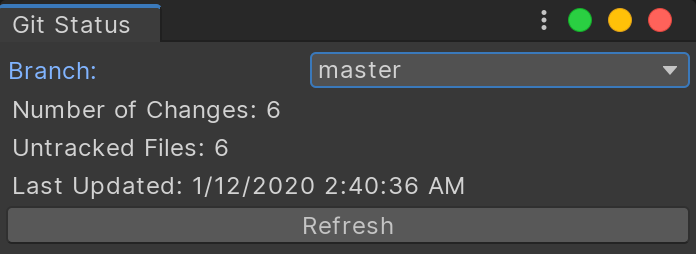

# GitStatus

> Unity editor panel that displays the current git status.

[](https://www.npmjs.com/package/xyz.candycoded.gitstatus)


<br>


## Features

- Asset status icons
- Branch switching
- Discard changes to files or folder
- Editor status panel
- MacOS and Windows support 🎉

## Install

### Unity Package Manager

#### Git

```json
{
  "dependencies": {
    "xyz.candycoded.gitstatus": "https://github.com/CandyCoded/gitstatus.git#v1.2.0",
    ...
  }
}
```

#### Scoped UPM Registry

```json
{
  "dependencies": {
    "xyz.candycoded.gitstatus": "1.2.0",
    ...
  },
  "scopedRegistries": [
    {
      "name": "candycoded",
      "url": "https://registry.npmjs.com",
      "scopes": ["xyz.candycoded"]
    }
  ]
}
```
